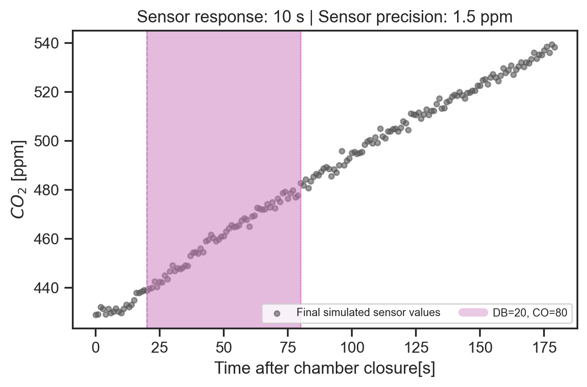
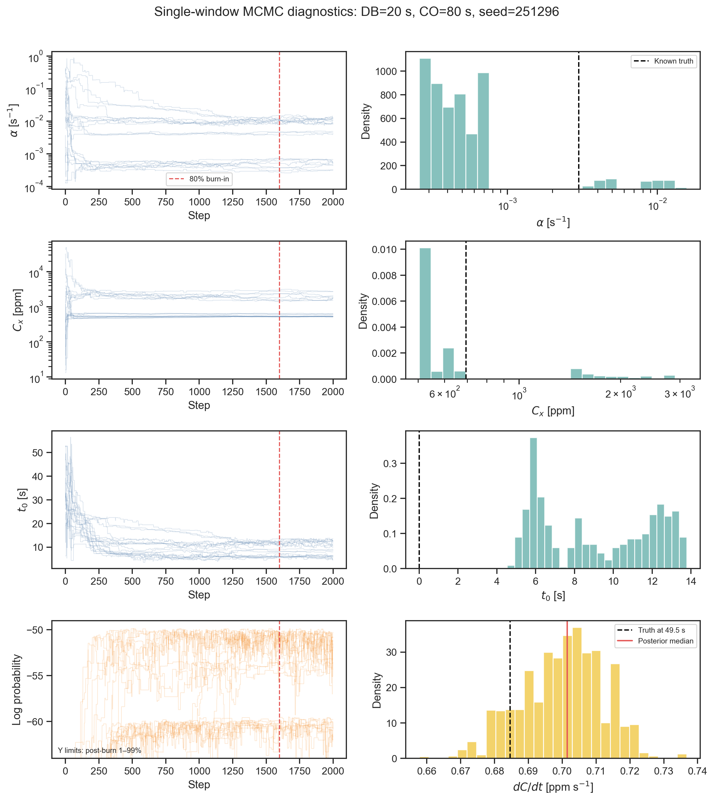
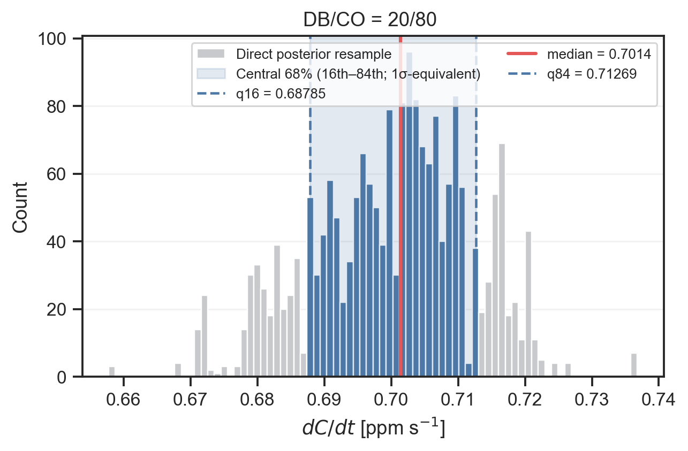
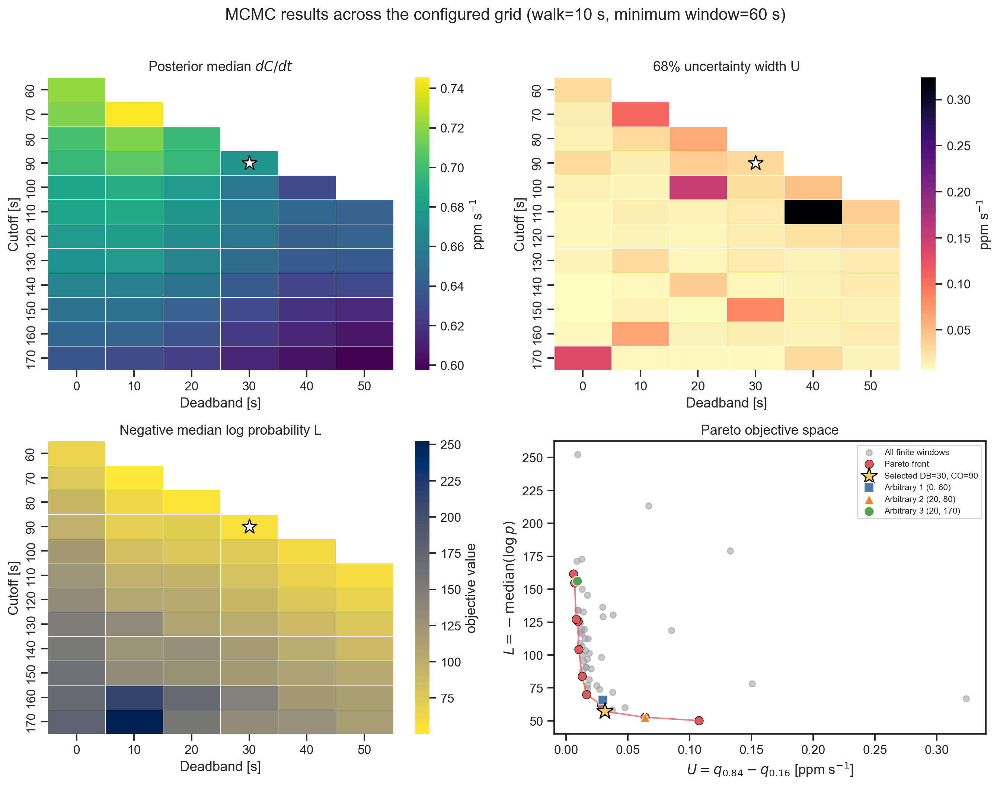
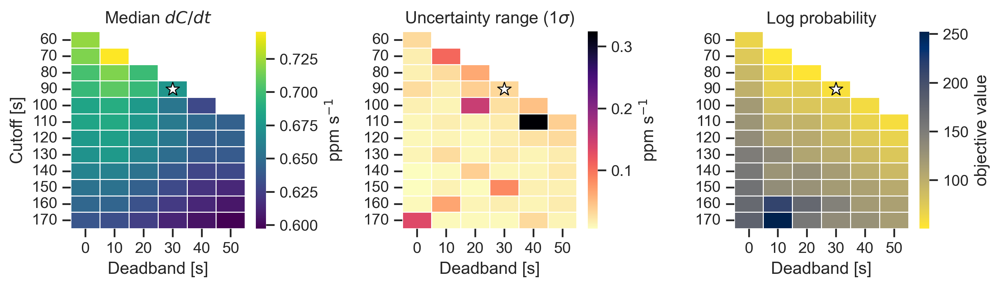
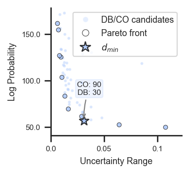
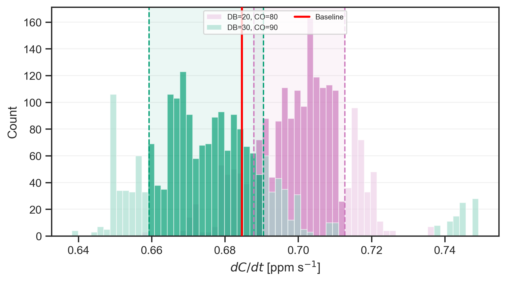
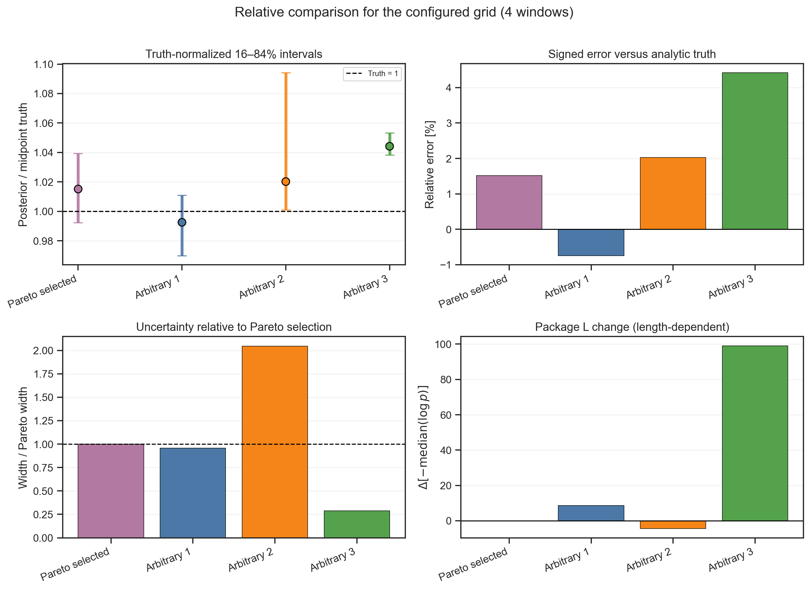

# Step-by-step configurable sensor simulation and MCMC processing

This is a standalone walkthrough of the single-measurement path behind [`01_process_raw_data.ipynb`](../01_process_raw_data.ipynb). The executable version is [`01_mcmc_toy_example.ipynb`](01_mcmc_toy_example.ipynb), and its regenerated raw input is [`toy_raw_data.csv`](toy_raw_data.csv).

The current raw trace is produced by the same `Generator` → `Simulate_Sensor` pipeline used by the Stage-3 synthetic workflow: ideal H–M source, chamber mixing, analyzer transport, response lag, and precision noise. The fitting code receives only the final sensor measurements and the configured sensor precision; the known source is used for evaluation.

Displayed numerical values are rounded to at most three decimal places. Scientific notation is used when ordinary rounding would hide the scale. The notebook calculations retain full floating-point precision.

## 1. Current configuration

The executed notebook uses:

| Group | Setting | Value |
|---|---|---:|
| Source | Initial concentration, $C_0$ | 430 ppm |
| Source | Curvature, $\alpha$ | $3\times10^{-3}$ s⁻¹ |
| Source | Start time, $t_0$ | 0 s |
| Source | Target increase at 179 s | 110 ppm |
| Sampling | Samples / interval | 180 / 1 s |
| Sensor | Response time | 10 s |
| Sensor | Analyzer volume | 120 cm³ |
| Sensor | Accuracy metadata | 1.5 ppm |
| Sensor | Precision | 1.5 ppm |
| Sensor | Pump volume / rate | 40 cm³ / 120 cm³ s⁻¹ |
| Sensor | Additional volume | 80 cm³ |
| Sensor | Diffusion / advection | enabled / enabled |
| Randomness | Sensor seed / MCMC seed | 251296 / 251296 |
| MCMC | Walkers / steps | 20 / 2000 |
| Worked example | Deadband / cutoff | 20 s / 80 s |
| Grid | Walk / minimum window | 10 s / 60 s |

The environment is 99,000 Pa, 20 °C, and 70% RH. A 20 cm diameter and 20 cm high chamber gives area 314.159 cm² and volume 6,283.185 cm³.

## 2. Define the ideal H–M source

The ideal concentration is

$$
C(t)=C_s+(C_0-C_s)\exp[-\alpha(t-t_0)],
$$

with analytic derivative

$$
\frac{dC}{dt}=\alpha(C_s-C_0)\exp[-\alpha(t-t_0)].
$$

The target change defines the source asymptote:

$$
C_s=C_0+\frac{110}{1-\exp(-\alpha\,179)}
=694.741\ \mathrm{ppm}.
$$

`Generator.generate_base` produces 180 ideal samples at 1 Hz, from 0 through 179 s. By construction,

$$
C(179)=430+110=540\ \mathrm{ppm}.
$$

The ideal concentration is retained for evaluation, while its derivative is passed to `Simulate_Sensor` as the chamber source. This document writes the known simulator asymptote as $C_s$ and the fitted processing parameter as $C_x$.

## 3. Simulate the configured sensor

The simulator proceeds in four stages:

1. Convert the analytic H–M derivative to a mass source and add it to the chamber.
2. Apply seeded stochastic diffusion and fan-driven advection.
3. Exchange gas through the chamber, pump, additional volume, and analyzer, producing internal analyzer concentration $g_i$.
4. Apply the 10 s response kernel and add 1.5 ppm Gaussian precision noise.

For analyzer increment $\Delta g_i=g_i-g_{i-1}$ and response time $r=10$, the linear response distributes each increment over the following ten samples:

$$
s_{i,k}=
\begin{cases}
\Delta g_i/r, & i\le k<i+r,\\
0, & \text{otherwise}.
\end{cases}
$$

The overlapping contributions are summed and cumulatively reconstructed:

$$
y_k^{(response)}=g_0+\sum_{j=0}^{k}\sum_i s_{i,j}.
$$

The final sensor value is

$$
y_k=y_k^{(response)}+\epsilon_k,
\qquad
\epsilon_k\sim\mathcal N(0,1.5^2)\ \mathrm{ppm}.
$$

The notebook retains the internal analyzer and zero-precision response traces for diagnosis. The maximum absolute difference between the response-only and ideal traces is 6.835 ppm. `sensor_accuracy=1.5` ppm is stored as metadata, but the current simulator does not apply an accuracy offset; precision noise is applied.

The simulation saves and restores NumPy’s global random state. Repeating the complete simulation with seed 251296 reproduces every value exactly. The final sensor trace begins

$$
[428.982,\ 429.225,\ 432.229,\ 431.407,\ 429.158]\ \mathrm{ppm},
$$

and ends at 538.352 ppm.

## 4. Save, reload, and normalize the raw data

The CSV stores full-precision values and user-facing metadata. It is reloaded with round-trip float parsing, and its `co2_ppm` array is asserted exactly equal to the generated trace.

| Raw CSV field | Canonical FCS field | Unit |
|---|---|---|
| `timestamp_utc` | `datetime` | datetime |
| `measurement_id` | `id` | text |
| `elapsed_s` | `timedelta` | s |
| `co2_ppm` | `k30_co2` | ppm |
| `temperature_c` | `si_temperature` | °C |
| `relative_humidity_percent` | `si_humidity` | % |
| `pressure_pa` | `bmp_pressure` | Pa |

The metadata-only fields `sensor_response_time_s=10` and `sensor_precision_ppm=1.5` remain in the CSV but are not copied into the seven-column canonical table. Checks verify 180 rows, contiguous one-second timestamps, elapsed positions 0–179, one measurement ID, the canonical schema, fixed metadata, and no nulls.

## 5. Estimate the initial concentration and deterministic seed

The fitting path estimates $C_0$ from the first ten final sensor measurements:

$$
y_i=\beta_0+\beta_1 i+e_i,
\qquad i=1,\ldots,10,
$$

$$
\widehat{\boldsymbol\beta}
=(X^TX)^{-1}X^T\mathbf y,
\qquad
\widehat C_0=\widehat\beta_0.
$$

The manual calculation and `HM_model.C_0_calculated` agree at

$$
\widehat C_0=429.889\ \mathrm{ppm}.
$$

The deterministic fit uses `[20:80]`: deadband 20 is included, cutoff 80 is excluded, and there are 60 observations. It fixes $C_0$, constrains $\alpha\ge0$, and constrains $0\le t_0\le80$ s.

| Seed parameter | Best fit |
|---|---:|
| Fixed $C_0$ | 429.889 ppm |
| $C_x$ | 534.627 ppm |
| $\alpha$ | $9.581\times10^{-3}$ s⁻¹ |
| $t_0$ | 11.533 s |

These seed values initialize the MCMC calculation; the manual likelihood and MCMC use the full-precision OLS value of $C_0$.

## 6. Fully worked DB 20 / CO 80 calculation

The slice `[20:80]` contains observations at $t_i=20,\ldots,79$ s. Its median timestamp is

$$
t_{mid}=49.5\ \mathrm{s}.
$$

For the deterministic proposal and configured uncertainty,

$$
C_0=429.889\ \mathrm{ppm},\quad
C_x=534.627\ \mathrm{ppm},
$$

$$
\alpha=9.581\times10^{-3}\ \mathrm{s^{-1}},\quad
t_0=11.533\ \mathrm{s},\quad
\sigma=1.5\ \mathrm{ppm}.
$$

For every observation, calculate

$$
e_i=-\alpha(t_i-t_0),
\qquad
f_i=\exp(e_i),
$$

$$
C_i=C_x+(C_0-C_x)f_i,
$$

$$
\left.\frac{dC}{dt}\right|_{t_i}
=\alpha(C_x-C_0)f_i,
$$

$$
r_i=y_i-C_i,
$$

$$
\ell_i=-\frac12\left[
\frac{r_i^2}{\sigma^2}+\log(\sigma^2)
\right].
$$

### 6.1 First selected observation

For row 20, $t=20$ s and $y=439.011$ ppm:

$$
e_{20}=-(9.581\times10^{-3})(20-11.533)=-0.081,
$$

$$
f_{20}=\exp(-0.081)=0.922,
$$

$$
\begin{aligned}
C(20)
&=534.627+(429.889-534.627)(0.922)\\
&=438.050\ \mathrm{ppm},
\end{aligned}
$$

$$
r_{20}=439.011-438.050=0.961\ \mathrm{ppm},
$$

$$
\frac{r_{20}^2}{\sigma^2}
=\frac{0.961^2}{1.5^2}
=0.410,
$$

$$
\log(\sigma^2)=\log(1.5^2)=0.811,
$$

$$
\ell_{20}=-\frac12(0.410+0.811)=-0.610,
$$

$$
\begin{aligned}
\left.\frac{dC}{dt}\right|_{20}
&=(9.581\times10^{-3})(534.627-429.889)(0.922)\\
&=0.925\ \mathrm{ppm\ s^{-1}}.
\end{aligned}
$$

### 6.2 Sum all 60 likelihood contributions

The residual terms sum to

$$
\sum_{i=20}^{79}\frac{r_i^2}{1.5^2}=51.111.
$$

The fixed variance term contributes

$$
\sum_{i=20}^{79}\log(1.5^2)
=60\log(1.5^2)
=48.656.
$$

Therefore,

$$
\begin{aligned}
\log\mathcal L
&=-\frac12(51.111+48.656)\\
&=-\frac12(99.767)\\
&=-49.883.
\end{aligned}
$$

The manual result agrees with `MCMC.ln_likelihood` within $10^{-10}$.

### 6.3 Evaluate the seed curve at the midpoint

At 49.5 s,

$$
e_{mid}=-0.364,
\qquad
\exp(e_{mid})=0.695,
$$

$$
C(49.5)=461.827\ \mathrm{ppm},
$$

$$
\left.\frac{dC}{dt}\right|_{49.5}
=0.697\ \mathrm{ppm\ s^{-1}}.
$$

| Location | Time [s] | Measured [ppm] | Exponent | Exp. factor | $C(t)$ [ppm] | $dC/dt$ [ppm s⁻¹] | Residual [ppm] | $\ell_i$ |
|---|---:|---:|---:|---:|---:|---:|---:|---:|
| First selected row | 20 | 439.011 | −0.081 | 0.922 | 438.050 | 0.925 | 0.961 | −0.610 |
| Window midpoint | 49.5 | — | −0.364 | 0.695 | 461.827 | 0.697 | — | — |
| Final selected row | 79 | 477.750 | −0.646 | 0.524 | 479.751 | 0.526 | −2.000 | −1.295 |

Show all 60 concentration, derivative, residual, and likelihood rows

Rates are in ppm s⁻¹; concentrations and residuals are in ppm. Each displayed value is rounded to three decimal places, while the notebook checks full-precision arrays against `hm_model`, `hm_model_dcdt`, and `MCMC.ln_likelihood`.

| Row | $t_i$ | $y_i$ | $e_i$ | $e^{e_i}$ | $C_i$ | $dC/dt_i$ | $r_i$ | $r_i^2/\sigma^2$ | $\log\sigma^2$ | $\ell_i$ |
|---:|---:|---:|---:|---:|---:|---:|---:|---:|---:|---:|
| 20 | 20 | 439.011 | -0.081 | 0.922 | 438.050 | 0.925 | 0.961 | 0.410 | 0.811 | -0.610 |
| 21 | 21 | 439.748 | -0.091 | 0.913 | 438.971 | 0.916 | 0.777 | 0.268 | 0.811 | -0.540 |
| 22 | 22 | 440.069 | -0.100 | 0.905 | 439.883 | 0.908 | 0.186 | 0.015 | 0.811 | -0.413 |
| 23 | 23 | 442.655 | -0.110 | 0.896 | 440.786 | 0.899 | 1.869 | 1.552 | 0.811 | -1.182 |
| 24 | 24 | 440.455 | -0.119 | 0.887 | 441.681 | 0.890 | -1.226 | 0.668 | 0.811 | -0.740 |
| 25 | 25 | 442.460 | -0.129 | 0.879 | 442.567 | 0.882 | -0.108 | 0.005 | 0.811 | -0.408 |
| 26 | 26 | 442.215 | -0.139 | 0.871 | 443.445 | 0.874 | -1.231 | 0.673 | 0.811 | -0.742 |
| 27 | 27 | 445.159 | -0.148 | 0.862 | 444.315 | 0.865 | 0.845 | 0.317 | 0.811 | -0.564 |
| 28 | 28 | 443.537 | -0.158 | 0.854 | 445.176 | 0.857 | -1.638 | 1.193 | 0.811 | -1.002 |
| 29 | 29 | 446.728 | -0.167 | 0.846 | 446.029 | 0.849 | 0.699 | 0.217 | 0.811 | -0.514 |
| 30 | 30 | 449.145 | -0.177 | 0.838 | 446.873 | 0.841 | 2.272 | 2.294 | 0.811 | -1.553 |
| 31 | 31 | 447.047 | -0.187 | 0.830 | 447.710 | 0.833 | -0.663 | 0.195 | 0.811 | -0.503 |
| 32 | 32 | 448.144 | -0.196 | 0.822 | 448.539 | 0.825 | -0.395 | 0.069 | 0.811 | -0.440 |
| 33 | 33 | 447.739 | -0.206 | 0.814 | 449.360 | 0.817 | -1.620 | 1.167 | 0.811 | -0.989 |
| 34 | 34 | 448.224 | -0.215 | 0.806 | 450.173 | 0.809 | -1.949 | 1.688 | 0.811 | -1.249 |
| 35 | 35 | 449.267 | -0.225 | 0.799 | 450.978 | 0.801 | -1.711 | 1.301 | 0.811 | -1.056 |
| 36 | 36 | 449.016 | -0.234 | 0.791 | 451.776 | 0.794 | -2.760 | 3.385 | 0.811 | -2.098 |
| 37 | 37 | 453.044 | -0.244 | 0.783 | 452.566 | 0.786 | 0.478 | 0.102 | 0.811 | -0.456 |
| 38 | 38 | 454.424 | -0.254 | 0.776 | 453.348 | 0.779 | 1.076 | 0.515 | 0.811 | -0.663 |
| 39 | 39 | 454.556 | -0.263 | 0.769 | 454.123 | 0.771 | 0.433 | 0.083 | 0.811 | -0.447 |
| 40 | 40 | 454.041 | -0.273 | 0.761 | 454.891 | 0.764 | -0.850 | 0.321 | 0.811 | -0.566 |
| 41 | 41 | 456.166 | -0.282 | 0.754 | 455.651 | 0.757 | 0.515 | 0.118 | 0.811 | -0.464 |
| 42 | 42 | 454.602 | -0.292 | 0.747 | 456.404 | 0.749 | -1.802 | 1.443 | 0.811 | -1.127 |
| 43 | 43 | 459.131 | -0.301 | 0.740 | 457.150 | 0.742 | 1.981 | 1.745 | 0.811 | -1.278 |
| 44 | 44 | 459.578 | -0.311 | 0.733 | 457.888 | 0.735 | 1.689 | 1.268 | 0.811 | -1.040 |
| 45 | 45 | 461.698 | -0.321 | 0.726 | 458.620 | 0.728 | 3.078 | 4.211 | 0.811 | -2.511 |
| 46 | 46 | 460.394 | -0.330 | 0.719 | 459.345 | 0.721 | 1.050 | 0.490 | 0.811 | -0.650 |
| 47 | 47 | 459.028 | -0.340 | 0.712 | 460.063 | 0.714 | -1.034 | 0.476 | 0.811 | -0.643 |
| 48 | 48 | 459.917 | -0.349 | 0.705 | 460.774 | 0.708 | -0.857 | 0.326 | 0.811 | -0.569 |
| 49 | 49 | 460.980 | -0.359 | 0.698 | 461.478 | 0.701 | -0.497 | 0.110 | 0.811 | -0.460 |
| 50 | 50 | 461.246 | -0.369 | 0.692 | 462.175 | 0.694 | -0.930 | 0.384 | 0.811 | -0.598 |
| 51 | 51 | 463.044 | -0.378 | 0.685 | 462.866 | 0.688 | 0.178 | 0.014 | 0.811 | -0.412 |
| 52 | 52 | 464.310 | -0.388 | 0.679 | 463.550 | 0.681 | 0.760 | 0.256 | 0.811 | -0.534 |
| 53 | 53 | 465.730 | -0.397 | 0.672 | 464.228 | 0.674 | 1.502 | 1.002 | 0.811 | -0.907 |
| 54 | 54 | 464.821 | -0.407 | 0.666 | 464.899 | 0.668 | -0.078 | 0.003 | 0.811 | -0.407 |
| 55 | 55 | 465.126 | -0.416 | 0.659 | 465.564 | 0.662 | -0.438 | 0.085 | 0.811 | -0.448 |
| 56 | 56 | 465.697 | -0.426 | 0.653 | 466.223 | 0.655 | -0.525 | 0.123 | 0.811 | -0.467 |
| 57 | 57 | 467.473 | -0.436 | 0.647 | 466.875 | 0.649 | 0.598 | 0.159 | 0.811 | -0.485 |
| 58 | 58 | 468.487 | -0.445 | 0.641 | 467.521 | 0.643 | 0.966 | 0.414 | 0.811 | -0.613 |
| 59 | 59 | 467.936 | -0.455 | 0.635 | 468.161 | 0.637 | -0.225 | 0.022 | 0.811 | -0.417 |
| 60 | 60 | 465.170 | -0.464 | 0.629 | 468.794 | 0.631 | -3.624 | 5.838 | 0.811 | -3.325 |
| 61 | 61 | 469.248 | -0.474 | 0.623 | 469.422 | 0.625 | -0.174 | 0.013 | 0.811 | -0.412 |
| 62 | 62 | 469.525 | -0.484 | 0.617 | 470.044 | 0.619 | -0.519 | 0.120 | 0.811 | -0.465 |
| 63 | 63 | 472.732 | -0.493 | 0.611 | 470.660 | 0.613 | 2.072 | 1.908 | 0.811 | -1.359 |
| 64 | 64 | 472.324 | -0.503 | 0.605 | 471.270 | 0.607 | 1.054 | 0.494 | 0.811 | -0.652 |
| 65 | 65 | 471.976 | -0.512 | 0.599 | 471.874 | 0.601 | 0.103 | 0.005 | 0.811 | -0.408 |
| 66 | 66 | 472.184 | -0.522 | 0.593 | 472.472 | 0.595 | -0.288 | 0.037 | 0.811 | -0.424 |
| 67 | 67 | 474.285 | -0.531 | 0.588 | 473.065 | 0.590 | 1.221 | 0.662 | 0.811 | -0.737 |
| 68 | 68 | 472.981 | -0.541 | 0.582 | 473.652 | 0.584 | -0.671 | 0.200 | 0.811 | -0.506 |
| 69 | 69 | 474.921 | -0.551 | 0.577 | 474.233 | 0.579 | 0.688 | 0.211 | 0.811 | -0.511 |
| 70 | 70 | 472.552 | -0.560 | 0.571 | 474.809 | 0.573 | -2.257 | 2.264 | 0.811 | -1.538 |
| 71 | 71 | 476.430 | -0.570 | 0.566 | 475.379 | 0.568 | 1.051 | 0.491 | 0.811 | -0.651 |
| 72 | 72 | 475.149 | -0.579 | 0.560 | 475.944 | 0.562 | -0.795 | 0.281 | 0.811 | -0.546 |
| 73 | 73 | 478.776 | -0.589 | 0.555 | 476.504 | 0.557 | 2.272 | 2.294 | 0.811 | -1.552 |
| 74 | 74 | 479.206 | -0.598 | 0.550 | 477.058 | 0.552 | 2.149 | 2.052 | 0.811 | -1.431 |
| 75 | 75 | 476.446 | -0.608 | 0.544 | 477.607 | 0.546 | -1.160 | 0.598 | 0.811 | -0.705 |
| 76 | 76 | 478.713 | -0.618 | 0.539 | 478.150 | 0.541 | 0.563 | 0.141 | 0.811 | -0.476 |
| 77 | 77 | 479.799 | -0.627 | 0.534 | 478.689 | 0.536 | 1.110 | 0.548 | 0.811 | -0.679 |
| 78 | 78 | 477.055 | -0.637 | 0.529 | 479.222 | 0.531 | -2.167 | 2.088 | 0.811 | -1.449 |
| 79 | 79 | 477.750 | -0.646 | 0.524 | 479.751 | 0.526 | -2.000 | 1.778 | 0.811 | -1.295 |

## 7. Apply the prior and run MCMC

For proposed $\theta=(\alpha,C_x,t_0)$, the package uses

$$
\log p(\theta)=
\begin{cases}
0,&10^{-2}\alpha_{bf}<\alpha<10^2\alpha_{bf}
\quad\text{and}\quad
10^{-2}C_{x,bf}<C_x<10^2C_{x,bf},\\
-\infty,&\text{otherwise}.
\end{cases}
$$

If the prior is finite, every proposal repeats the 60-row $C(t_i)$ and likelihood calculation:

$$
\log p(\theta\mid\mathbf y)
=\log p(\theta)+\log\mathcal L(\theta).
$$

Only $\alpha$ and $C_x$ are prior-bounded. Walkers start with $t_0\sim U(0,60)$ s, but the implemented prior does not bound $t_0$. The posterior is therefore improper, so its intervals reproduce package behavior but are not valid Bayesian credible intervals.

With MCMC seed 251296, 20 walkers and 2000 steps produce a chain of shape `(2000, 20, 3)`. After 80% burn-in and thinning by 15, 520 states remain. The implementation then draws 2000 derivative values with replacement.

For the directly seeded DB 20 / CO 80 run,

$$
q_{16}=0.688,\qquad
q_{50}=0.701,\qquad
q_{84}=0.713\ \mathrm{ppm\ s^{-1}}.
$$

The ideal source derivative at 49.5 s is 0.685 ppm s⁻¹. The highlighted range is **1σ-equivalent** because a Gaussian places about 68% of its mass between the 16th and 84th percentiles. It is not calculated as mean ± standard deviation.

This histogram uses the directly seeded worked-window chain. In the later grid, earlier windows advance the random-number sequence before DB 20 / CO 80 is reached; the grid cell can therefore have different short-chain quantiles.

## 8. Water correction and flux conversion

The water correction uses Buck’s equation, with temperature in °C and pressure in kPa:

$$
e_s(T)=6.112\times10^{-1}\exp\left[
\left(18.678-\frac{T}{234.5}\right)
\frac{T}{257.14+T}
\right],
$$

$$
W_0=1000\frac{e_s(T)(RH/100)}{P_0}.
$$

At 20 °C, 70% RH, and 99 kPa,

$$
e_s=2.338\ \mathrm{kPa},
\qquad
W_0=16.534\ \mathrm{mmol\ mol^{-1}}.
$$

The package converts concentration rate to flux with

$$
F=\frac{10VP_0(1-W_0/1000)}{RA(T+273.15)}\frac{dC}{dt},
$$

where $V$ is in cm³, $A$ in cm², $R=8.314\ \mathrm{J\,K^{-1}\,mol^{-1}}$, and $F$ is in µmol m⁻² s⁻¹. For this configuration,

$$
F=7.989\frac{dC}{dt}.
$$

## 9. Evaluate the deadband/cutoff grid

The in-memory `FCS.run_MC` calculation uses:

- deadbands `[0, 10, 20, 30, 40, 50]`;
- cutoffs `[60, 70, ..., 170]`;
- only windows satisfying `cutoff - deadband >= 60`.

The resulting `xarray.Dataset` has dimensions `cutoff=12`, `deadband=6`, and `MC=2000`. There are 57 candidate windows, and all 57 have finite fits. Cutoff is exclusive. These positions represent seconds only because the trace is contiguous at 1 Hz.

For every finite window,

$$
U=q_{0.84}(dC/dt)-q_{0.16}(dC/dt),
\qquad
L=-\operatorname{median}(\log p).
$$

Each objective is independently min-max normalized:

$$
U_n=\frac{U-U_{min}}{U_{max}-U_{min}},
\qquad
L_n=\frac{L-L_{min}}{L_{max}-L_{min}}.
$$

The non-dominated points minimize both objectives. The selected compromise is the Pareto point nearest the normalized origin:

$$
d=\sqrt{U_n^2+L_n^2}.
$$

The executed run finds 11 Pareto points and selects

$$
\boxed{\text{deadband}=30\ \mathrm{s},\qquad
\text{cutoff}=90\ \mathrm{s}}.
$$

The log likelihood is summed over observations, so $L$ is window-length dependent. It is not a per-observation goodness-of-fit statistic, and the Pareto choice inherits this length dependence.

For inspecting the gridded results without the Pareto front or objective-space scatter, the notebook also writes the three matrices as a horizontal figure. A small star marks the Pareto-selected DB/CO cell on the posterior median, uncertainty-width, and negative median log-probability heatmaps.

The notebook also renders the same objective space with the paper styling from `03_pareto_lowcost_vs_commercial.ipynb`: the low-cost `coolwarm` color, small translucent circles for all finite windows, black-edged circles for the Pareto front, and a black-edged star for the selected minimum-distance point.

The configured worked window and Pareto-optimal window can also be compared directly as overlapping posterior histograms with shared bins. Each distribution uses a light outer tone and a darker central-68% tone, matching the logic of Figure 05. Purple represents the directly seeded DB 20 / CO 80 chain, with $q_{16}/q_{50}/q_{84}=0.688/0.701/0.713$ ppm s⁻¹ and midpoint truth 0.685 ppm s⁻¹. Green represents the DB 30 / CO 90 grid chain, with $q_{16}/q_{50}/q_{84}=0.659/0.674/0.690$ ppm s⁻¹ and midpoint truth 0.664 ppm s⁻¹. This window-comparison palette is deliberately separate from the low-cost/commercial sensor palette. Both medians are red and both truth references are black; solid/dashed and dotted/dash-dot line styles distinguish the two windows.

## 10. Compare the Pareto and arbitrary windows

The arbitrary configurations are `(0, 60)`, `(20, 80)`, and `(20, 170)`. Each fitted derivative is compared with the ideal derivative at its own window midpoint:

$$
\text{relative error}=100\,
\frac{\operatorname{median}(dC/dt)-dC/dt_{ideal}(t_{mid})}
{|dC/dt_{ideal}(t_{mid})|}.
$$

The relative comparison metrics are

$$
\text{width ratio}=\frac{U_{window}}{U_{Pareto}},
\qquad
\Delta L=L_{window}-L_{Pareto}.
$$

| Configuration | DB / CO [s] | Midpoint [s] | $q_{16}$ | Median | $q_{84}$ | Ideal truth | Relative error | $U$ | $U/U_P$ | $L$ | $\Delta L$ | Median flux / truth flux |
|---|---:|---:|---:|---:|---:|---:|---:|---:|---:|---:|---:|---:|
| Pareto selected | 30 / 90 | 59.5 | 0.659 | 0.674 | 0.690 | 0.664 | 1.517% | 0.031 | 1.000 | 57.179 | 0.000 | 5.388 / 5.308 |
| Arbitrary 1 | 0 / 60 | 29.5 | 0.705 | 0.722 | 0.735 | 0.727 | −0.744% | 0.030 | 0.957 | 65.914 | 8.735 | 5.765 / 5.808 |
| Arbitrary 2 | 20 / 80 | 49.5 | 0.685 | 0.698 | 0.749 | 0.685 | 2.023% | 0.064 | 2.046 | 52.715 | −4.464 | 5.580 / 5.470 |
| Arbitrary 3 | 20 / 170 | 94.5 | 0.621 | 0.625 | 0.630 | 0.598 | 4.420% | 0.009 | 0.289 | 156.287 | 99.108 | 4.990 / 4.779 |

Rates and interval widths are in ppm s⁻¹; fluxes are in µmol m⁻² s⁻¹. The signed errors include analyzer transport, stochastic mixing, response lag, precision noise, and H–M fitting behavior. Differences in $L$ across unequal window lengths must not be interpreted as per-observation changes in fit quality.

## 11. Verification and interpretation limits

- The current 180-value sensor trace reproduces exactly with sensor seed 251296, and the CSV round-trips the same float64 values.
- All 180 samples, timestamps, metadata, canonical values, internal-analyzer values after terminal fill, response-only values, and final sensor values are finite and pass the notebook checks.
- The manual and package $C_0$, $C(t)$, $dC/dt$, midpoint, and log-likelihood calculations agree within $10^{-10}$.
- The worked table contains exactly 60 rows, matching `80 - 20`.
- The direct posterior contains 2000 resampled values with ordered finite quantiles.
- The grid contains 57 candidate windows, 57 finite fits, 11 Pareto points, and a finite DB 30 / CO 90 selection.
- All 16 code cells are executed without stored errors, and all eight linked PNGs are non-empty.
- Sensor precision is used once to simulate the measurement noise and again as the likelihood’s `yerr`.
- The unbounded $t_0$ prior makes the implemented posterior improper; increasing the number of MCMC steps does not correct that model definition.
- The summed $L$ objective depends on window length.
- AIC, RMSE, R², and normalized RMSE are stored by `FCS.run_MC` but are not Pareto objectives.
- The 2000-step run demonstrates the configured implementation; convergence should be assessed separately for scientific use.
